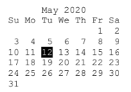

# Calender

Desktop python app that can provide the advanced functionalities that are not generally available in the default calendar module.

The application design follows the below guidelines:  

  The application is able to run with or without command line parameters.  
  When the application is run without command line parameters, it simply prints the current month’s calendar with current date highlighted.  
  The Month and Year appears on the top (for example, May 2020)  
  The Days appears in the next row (for example: Su Mo Tu We Th Fr Sa)  
  The full calendar of the month appears as follows:  
  
  
  With the commandline argument, the month is changed based on the commandline integer argument. That is, with -1, same date previous month will be printed and +5, same date, 5 months later will be printed
  
